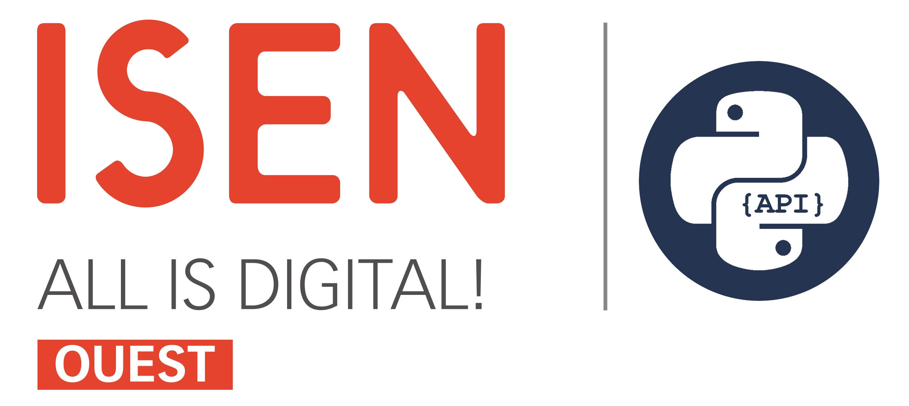

<p align="center"></a></p>

<br/>


<h2 style="font-family: sans-serif; font-weight: normal;" align="center"><strong>An API for ISEN-OUEST</strong> (unofficial)</h2>


<br/>

<h2 style="font-family: sans-serif; font-weight: normal;" align="center"><strong>⚠️ In development !!</strong></h2>

## Dépendance

- requests
- bs4

## Usage

Clone the repo, and ...

- `cd ISENpy/`
- `pip install -r requirements.txt`

Here is an example script:

```python
import ISENpy


client = ISENpy.ISEN(
                        username="<username>", 
                        password="<password>",

                        cycle="<cycle>", #Ex. "CIR" 
                        annee="<annee>", #Ex. "1" 
                        ville="<ville>"  #Ex. "Caen"
                    )


if not client.logged_in:
    print("Identifiant ou mot de passe incorect !!")
    exit()


print(client.classMember("CIR", "1", "Caen")) #Get all the students of the class CIR1 Caen
print(client.classMember()) #Get all the students of the class you are in
print(client.userInfo()) #Get your user info

webAurion = client.webAurion() #Get the webAurion object
absence = webAurion.absences() #Get your absences
grade = webAurion.grades() #Get your grades
planning = webAurion.planning() #Get your planning of the week. Argument(Optional) is the beginning of the week in the format "dd/mm/yyyy" Ex. "03/10/2022"

print(absence)
print(grade)
print(planning)

client.logout()

```


## LICENSE

Copyright (c) 2022 CorentinMre

Permission is hereby granted, free of charge, to any person obtaining a copy
of this software and associated documentation files (the "Software"), to deal
in the Software without restriction, including without limitation the rights
to use, copy, modify, merge, publish, distribute, sublicense, and/or sell
copies of the Software, and to permit persons to whom the Software is
furnished to do so, subject to the following conditions:

The above copyright notice and this permission notice shall be included in all
copies or substantial portions of the Software.

THE SOFTWARE IS PROVIDED "AS IS", WITHOUT WARRANTY OF ANY KIND, EXPRESS OR
IMPLIED, INCLUDING BUT NOT LIMITED TO THE WARRANTIES OF MERCHANTABILITY,
FITNESS FOR A PARTICULAR PURPOSE AND NONINFRINGEMENT. IN NO EVENT SHALL THE
AUTHORS OR COPYRIGHT HOLDERS BE LIABLE FOR ANY CLAIM, DAMAGES OR OTHER
LIABILITY, WHETHER IN AN ACTION OF CONTRACT, TORT OR OTHERWISE, ARISING FROM,
OUT OF OR IN CONNECTION WITH THE SOFTWARE OR THE USE OR OTHER DEALINGS IN THE
SOFTWARE.
